# How it works

Zellij Agent Threads has three small parts:

- the Pi extension
- the `agent-threads` CLI and SQLite store
- the Zellij plugin

The store is the source of truth. The pipe only wakes the plugin.

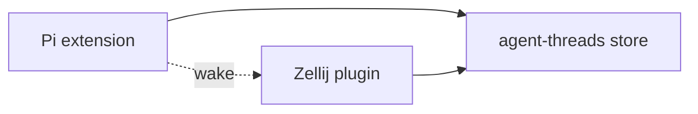

## 1. Pi writes reports

The Pi extension listens to Pi lifecycle events. It publishes an Agent Report when the session starts, runs, becomes idle, uses a tool, or shuts down.

Each report contains the agent state, pane ID, tab data, working directory, model, title, and update time.

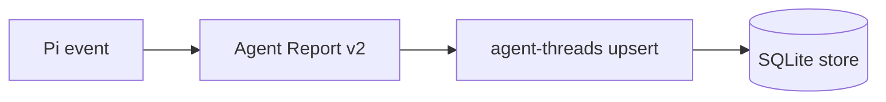

On shutdown, the extension deletes the row instead of writing a closed row.

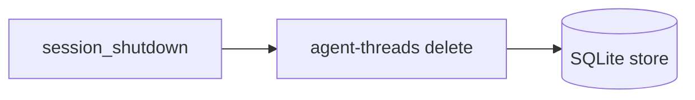

## 2. Pi wakes the plugin

After a store write, the Pi extension sends a Zellij pipe message.

This message does not carry the agent list. It only tells the plugin to read the store.

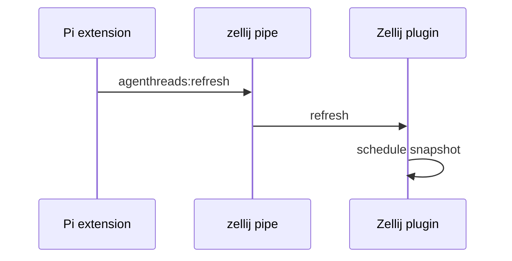

The extension also calls `zellij action list-panes --json`. It uses this data to add pane and tab metadata to the report.

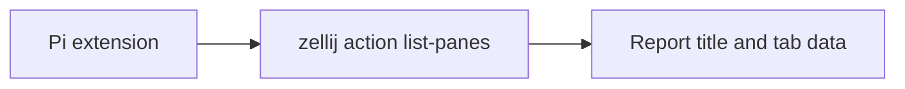

## 3. The store keeps one row per agent location

The CLI stores reports in SQLite. The row key uses the Zellij pane when it exists.

This means a restarted agent in the same pane replaces the old row.

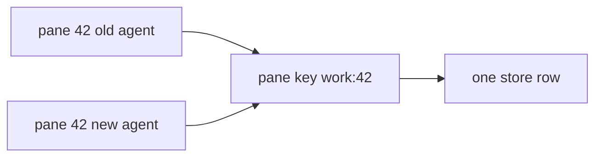

Each row has a lease. The default lease is 10 seconds. Each new report extends the lease.

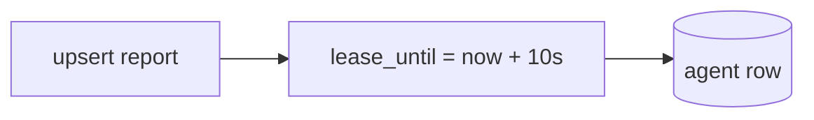

## 4. The plugin reads snapshots

The Zellij plugin does not receive all report data through the pipe. It runs the CLI and reads a snapshot.

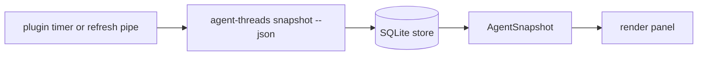

The plugin keeps a small in-memory model. A valid snapshot replaces that model.

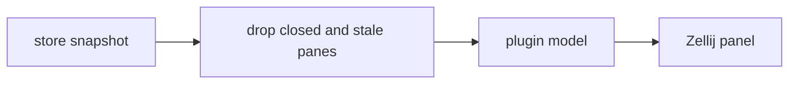

## 5. Stale entries are removed

Stale entries can come from a crash, a killed pane, or a missed shutdown event.

The system removes stale entries in three places.

### Store garbage collection

`agent-threads` removes expired rows when it writes or reads the store.

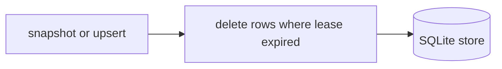

### Plugin lease expiry

The plugin also expires agents from memory after 10 seconds without a report.

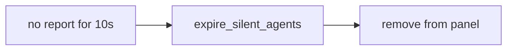

### Closed pane filtering

The plugin compares snapshot rows with live Zellij panes. If a row has a pane ID that no longer exists, the plugin ignores that row.

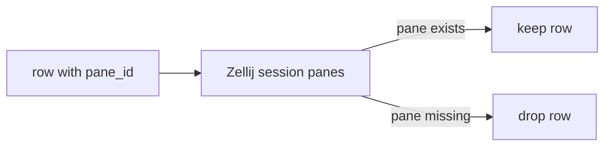

## Result

A normal update uses this path:

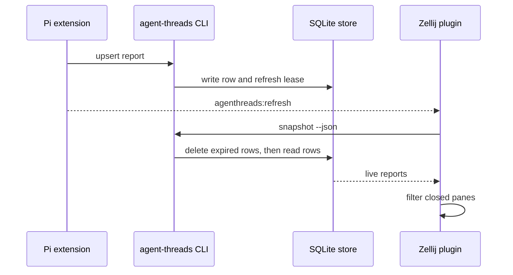

The store cleans old rows. The plugin also protects the panel from stale rows. No background sweeper is required.
