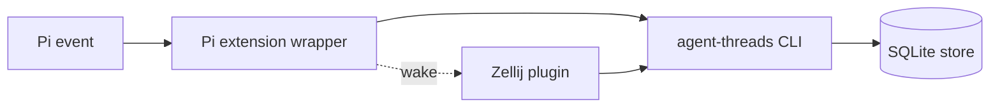
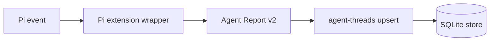
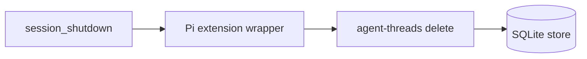
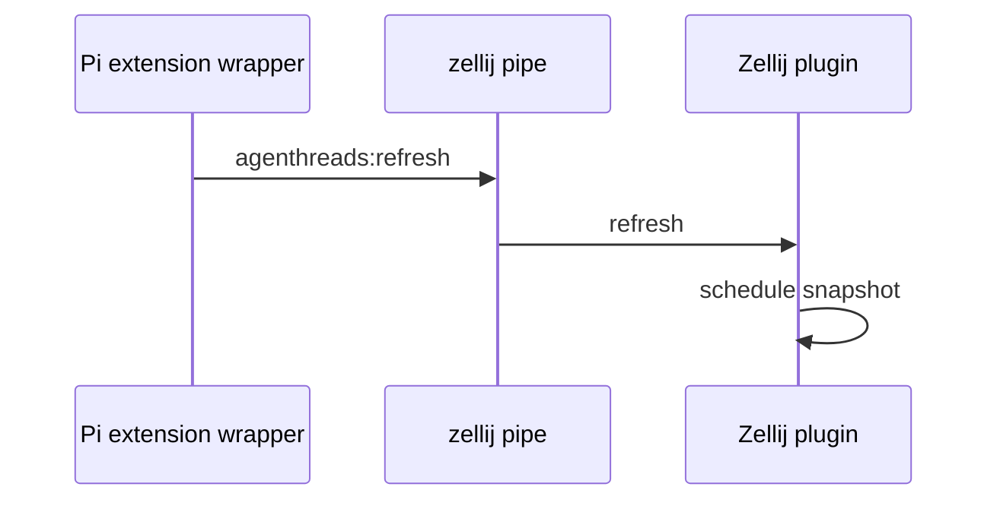
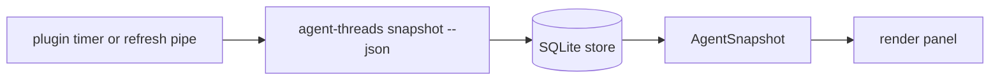
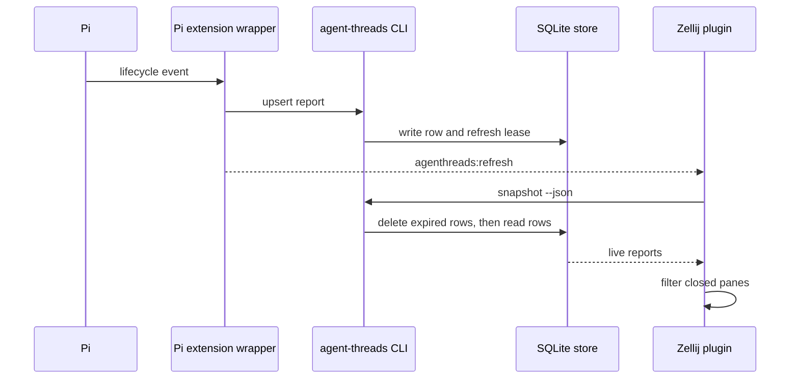

# How it works

Zellij Agent Threads has three parts:

- the Pi extension wrapper
- the `agent-threads` CLI and SQLite store
- the Zellij plugin

The `agent-threads` CLI is the data plane. The Pi extension only adapts Pi events into CLI calls.

The store is the source of truth. A Zellij pipe only wakes the plugin.



## 1. The Pi extension runs the CLI

The Pi extension listens to Pi lifecycle events.

It builds an Agent Report payload when Pi starts, changes state, uses a tool, or shuts down.

The extension does not keep Agent state. It runs the `agent-threads` CLI.



On shutdown, the extension runs `agent-threads delete` for that Agent.



Each report contains state, pane ID, tab data, working directory, model, title, harness, tool, and update time.

## 2. The extension wakes the plugin

After the CLI writes to the store, the Pi extension sends a Zellij pipe message.

The message does not carry the Agent list. It tells the plugin to read a fresh snapshot from the CLI.



The extension also calls `zellij action list-panes --json`. It uses this data to add pane and tab metadata to the report.

## 3. The store keeps one row per Agent location

The CLI stores reports in SQLite.

If a report has a Zellij pane ID, the row key uses the Zellij session and pane ID. This lets a restarted Agent in the same pane replace the old row.

If a report has no pane ID, the row key uses `agent_id`.

Each row has a lease. The default lease is 10 seconds. Each new report extends the lease.

## 4. The plugin reads snapshots

The plugin runs this command to read the current Agent list:

```sh
agent-threads snapshot --json
```

A valid snapshot replaces the plugin model.



The plugin filters rows for panes that no longer exist. This protects the panel from stale rows after a pane closes.

## 5. Stale rows disappear

Stale rows can come from a crash, a killed pane, or a missed shutdown event.

The system removes stale data in three places:

- The store deletes expired rows when it reads or writes.
- The plugin removes silent Agents from memory after 10 seconds.
- The plugin ignores snapshot rows for closed panes.

No background sweeper is required.

## Normal update path

A normal update uses this path:



The result is a small live panel that follows the current Zellij session.
